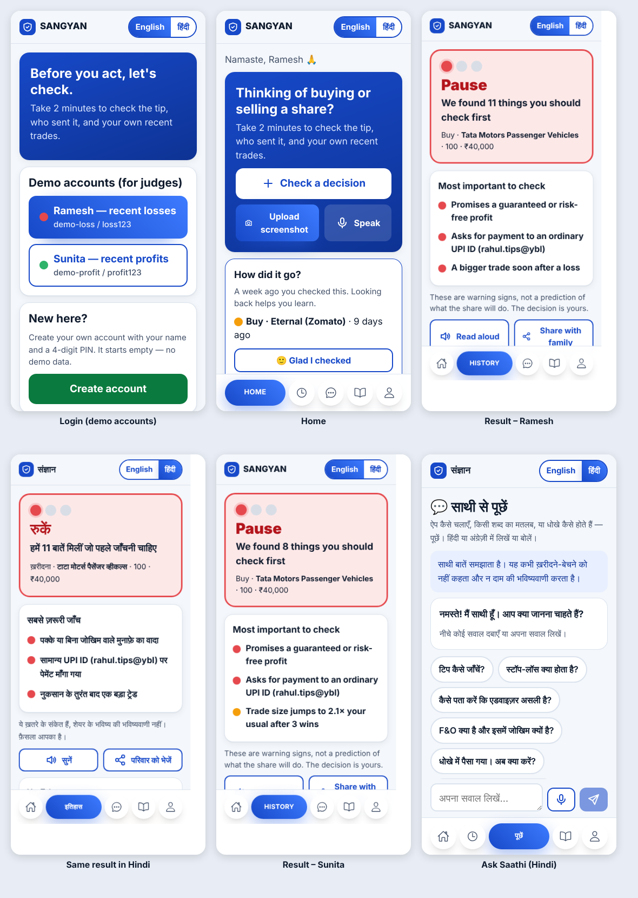

# SANGYAN Decision Guard — Hackathon Submission

**SANGYAN Investor Resilience Hackathon** (SNTC IIT BHU × SEBI × NSDL)

**Tagline:** *Before you act, let's check. / कुछ करने से पहले, चलिए जाँच लें।*

| Item | Details |
|---|---|
| Live app | `https://<your-app>.vercel.app` ← replace after deploy |
| Source code | `https://github.com/<you>/sangyan-decision-guard` ← replace |
| Demo video | `<link>` ← optional |
| Demo logins | `demo-loss` / `loss123` (Ramesh, recent losses) · `demo-profit` / `profit123` (Sunita, recent profits) |



## 1. Problem

Retail investors in Tier-2 and Tier-3 towns increasingly act on tips from WhatsApp, Telegram, YouTube and "finfluencers". SEBI warnings exist, but they arrive *after* the money is gone.

The risky moment is the 2 minutes **between seeing a tip and placing the trade**. At that moment the investor:

- doesn't check whether the tipper is SEBI-registered,
- doesn't notice red-flag words like "guaranteed" or "insider",
- doesn't notice that the tip is weeks old, and
- doesn't notice their own state of mind, such as chasing a loss or feeling overconfident after a few wins.

## 2. Solution

A **bilingual (हिंदी / English), mobile-first decision-safety check**. The user pastes, speaks, shares or screenshots a tip. In about 30 seconds the app checks four things together and shows 🟢 / 🟠 / 🔴, with the evidence behind every warning:

| Check | What it looks at |
|---|---|
| **The message** | Guaranteed or "risk-free" returns, urgency, insider claims, payment requests, fake apps or APKs, OTP requests. Works in English, Hindi and Hinglish. |
| **Who sent it** | SEBI registration numbers (INA/INH) checked against SEBI's registry, including whether the registered name matches the sender. Whether a UPI ID is a SEBI-validated **@valid** handle. Look-alike or short links. YouTube channel and speaker. News-channel guests are recognised. |
| **Is it still fresh?** | When the video or post was published, how much the price has moved since the tip, and the gap between the tip price and today's price. Old content forwarded as new is flagged. |
| **The user's own behaviour** | Loss streaks, loss-chasing, overconfidence after wins, bigger trades soon after a loss, overtrading, re-buying a stock that just lost money, herd or FOMO reasons. |

It also adds **company context** (SME or penny stock, typical daily move, 1-year range, recent news). A promised return is compared with the stock's real past moves.

### YouTube tips
With a Gemini key, the app **watches the first 10 minutes of a YouTube video**. It lists the exact claims with timestamps, any SEBI numbers or links shown on screen, and whether a disclaimer was given.

### Safety nudges
- **Cool-off timers:** "Wait 15 min" or "Sleep on it".
- **Decision journal:** 4 questions, which the user can speak or type.
- **7-day follow-up:** "How did it go?"
- **Share card:** a result card in Hindi to send to family on WhatsApp.

## 3. Hackathon guardrails (compliance)

- **No investment advice, ever.**
  - The app never says buy, sell or hold, never gives target prices and never makes predictions.
  - Advice requests are refused by fixed rules *before* any AI is called. Every AI output passes a second no-advice filter.
  - This is covered by automated tests (`npm run eval`).
- **Explainable:**
  - Every flag says *what was found*, *why it matters* and *what to check next*.
  - The verdict comes from transparent rules, not from an AI score.
- **Official sources first:** SEBI intermediary search, SEBI RSS, the @valid UPI framework, 1930 / cybercrime.gov.in, SCORES, Sanchar Saathi.
- **Privacy:**
  - No database.
  - Trade history and CSV imports are processed and stored on the user's phone only.
  - Login is a signed cookie.
- **Accessibility for Tier-2/3 users:**
  - Full Hindi on every screen.
  - Tap any underlined term for a simple explanation.
  - Voice input and read-aloud.
  - Big buttons, a light bundle, and installable as an app (PWA).

## 4. Features list

1. 3-step check: source → trade → reason (chips + voice)
2. Screenshot reading (Gemini, with on-device Tesseract fallback, Hindi + English)
3. Share a tip straight from WhatsApp into the app (Android PWA share target)
4. SEBI registration and name-match check; @valid UPI check; link checks
5. YouTube video analysis with timestamps; news-channel guest detection
6. Freshness check: source age, price moved since tip, tip-price gap
7. Behaviour analysis using the user's own trades (manual entry or broker CSV import)
8. Fraud Alerts feed: SEBI RSS + filtered news + "what the government is doing"
9. **Saathi** help chatbot (Hindi/English, voice, with an advice-refusal guard)
10. Learn: scam explainers + glossary
11. Cool-off timers, decision journal, 7-day follow-up, history
12. Accounts: 2 demo accounts + create your own (name + PIN → Login ID)

## 5. Tech stack

- **Frontend and backend:** Next.js 16 (App Router), React 19, TypeScript, Tailwind v4 (shadcn structure), installable PWA.
- **AI:** Google Gemini (optional). Used for OCR, video reading, web registry lookup, translation, chat and summaries. The app still works fully without a key, using rules plus on-device OCR.
- **Data:** SEBI intermediary search + RSS, NSE equity list (all main-board + SME companies via `npm run fetch-stocks`, with live Yahoo search as fallback), Yahoo Finance prices, Google News RSS, YouTube oEmbed.
- **Hosting:** Vercel (free tier).

## 6. Demo script (3 minutes)

1. **Log in as Ramesh** (`demo-loss`).
2. Check a WhatsApp tip: *"Tata Motors guaranteed 40% in 1 week, pay ₹2,999 to rahul.tips@ybl"* → 🔴 **Pause**. The flags are a guaranteed-return promise, a non-@valid UPI ID, and a bigger trade right after 3 losses.
3. Switch to **हिंदी** and show the same result in Hindi. Tap an underlined term to see its explanation.
4. **Log out and log in as Sunita** (`demo-profit`) and run the same tip. The behaviour flag changes to *overconfidence after 3 wins*.
5. Paste a YouTube tip link to show the video claims with timestamps, the SEBI lookup of the speaker, and the freshness check.
6. Open **Ask Saathi** and type "कौन सा शेयर खरीदूँ?". It refuses politely and explains how to check a tip instead.
7. Open **Learn → Alerts** to show recent fraud cases and the government measures.

## 7. Run locally

```bash
npm install
cp .env.example .env.local     # set SESSION_SECRET (any long random text) and GEMINI_API_KEY (optional)
npm run dev                    # open http://localhost:3000
npm run eval                   # automated safety + accuracy tests
```

Full deploy + mobile guide: `DEPLOY.md`.

## 8. Limitations / next steps

- The SEBI seed registry is partial. Live lookups depend on SEBI's website being reachable. Run `npm run fetch-sebi` to refresh.
- Video analysis depends on the Gemini free-tier quota. Analyses are cached in `data/video-cache/`.
- With no database, history stays on one phone. A future version could add opt-in sync and integrate with NSDL/CDSL CAS statements.
